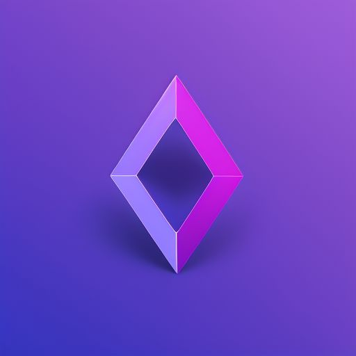

<h1 align="center">Tessellate</h1> 

    

<h1 align="center">3D scientific data visualization and plotting tool for Rust.</h1>

Inspired by pyvista and VTK. 
Fully written in Rust for speed and safety.

# Features

- 🖼️ Interactive 3D visualization
- 📊 3D Data manipulation and analysis
- 🛠️ Mesh generation and manipulation
- 📂 Supports various scientific data formats

The project is in early development stage.

The documentation is available [here](https://besok.github.io/tessellate/).

# Contributing

The project is very welcomed to contributions. 
Please read the [Contributing Guidelines](./CONTRIBUTING.md) before contributing.
