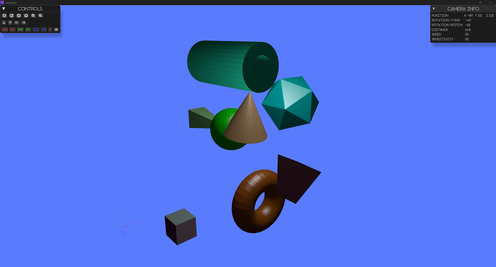

# Basic shapes

This section covers the creation of basic geometric shapes using `tesselate`.

 

The running example can be found 
in the <a href="https://github.com/besok/tessellate/tree/main/examples/basic_shapes" target="_blank">repository</a>

## Shapes
 - cuboid
   - cube
   - rectangle cuboid
 - beam
 - cylinder
 - cone
 - grid
 - icosahedron
 - plane
 - pyramid
 - ring
 - sphere
 - torus

All shapes are created using the `tesselate` module. 
The module provides a set of functions to create the shapes.
All shapes have  default method and `create` method.

### Example

```rust
use glam::{Mat4, Quat, Vec3};
use tessellate::mesh::shape::pyramid::Pyramid;
use tessellate::mesh::shape::sphere::Sphere;

fn pyramid() -> Result<Pyramid, TessError> {
    let mut pyramid = Pyramid::default();
    pyramid.transform(Mat4::from_rotation_translation(
        Quat::from_rotation_x(0.0),
        Vec3::new(0.0, 1.0, -3.0),
    ))?;
    Ok(pyramid)
}

fn green_sphere() -> TessResult<Sphere> {
    Ok(Sphere::create_ico(Vertex::default(), 1.0, 3, RgbaColor::GREEN.into()))
}

```