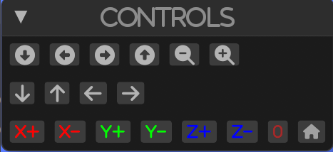

# Controls

By default, there are several controls that are available to the user. 
These controls are used to manipulate the camera. 

## Camera controls by mouse
With left mouse button, you can rotate the camera around the object.
With right mouse button, you can shift the camera in the plane perpendicular to the view direction.
With middle mouse button, you can zoom in and out.

## UI controls
The UI controls are displayed on the left side of the screen.

with the UI controls, you can:
- Rotate the camera around the object 
- Shift the camera in the plane perpendicular to the view direction
- Zoom in and out
- (X,Y,Z) +- set the camera position to 0 in the space according to the axis and button pressed
- Reset the camera position to the initial position
- Set all axes to 0