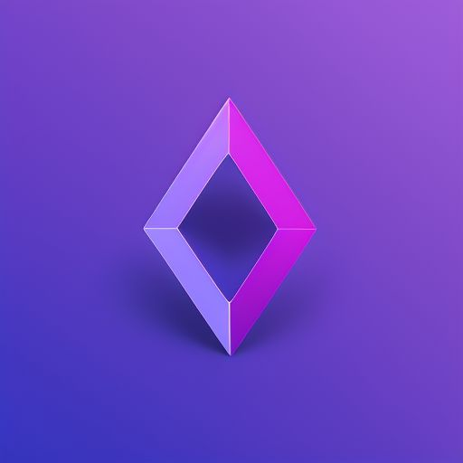

<div align="center">

# Tessellate



### 3D Scientific Data Visualization and Plotting Tool for Rust

[](https://crates.io/crates/tessellate)
[](https://docs.rs/tessellate)
[](LICENSE.md)

</div>

## Overview

Tessellate is a powerful 3D scientific visualization library written in Rust, 
designed for performance and safety. 
Drawing inspiration from PyVista and VTK, 
it provides a robust foundation for creating sophisticated scientific visualizations.

## Features

- 🚀 **Robustness**: Written entirely in Rust for maximum speed and efficiency
- 🛡️ **Memory Safe**: Leverages Rust's safety guarantees
- 📊 **Scientific Visualization**: Specialized tools for scientific data representation
- 🎨 **3D Plotting**: Comprehensive 3D plotting capabilities

## Installation

Add Tessellate to your `Cargo.toml`:

```toml
[dependencies]
tessellate = "0.1.0"
```

## Quick Start

```rust

use tessellate::*;
use glam::Vec3;

fn main() -> TessResult<()> {
    let meshes = vec![
        Torus::default().into(),
    ];

    let opts = GpuOptions::new(
        CameraOptions::new_position(Vec3::new(0.0, 5.0, 10.0)),
        LightOptions::new_position(Vec3::new(0.0, 5.0, 3.0)),
    );

    Ok(gpu::visualize(meshes, opts)?)
}
```

## Documentation

This book provides a comprehensive guide to Tessellate's features and capabilities.
For detailed information on the API, please refer to the [API Documentation](https://docs.rs/tessellate).


## Contributing

We welcome contributions! Please see our [Contributing Guide](CONTRIBUTING.md) for details.

## License

This project is licensed under the MIT License - see the [LICENSE](LICENSE) file for details.

---

<div align="center">
Made with ❤️ by the Tessellate Team
</div>