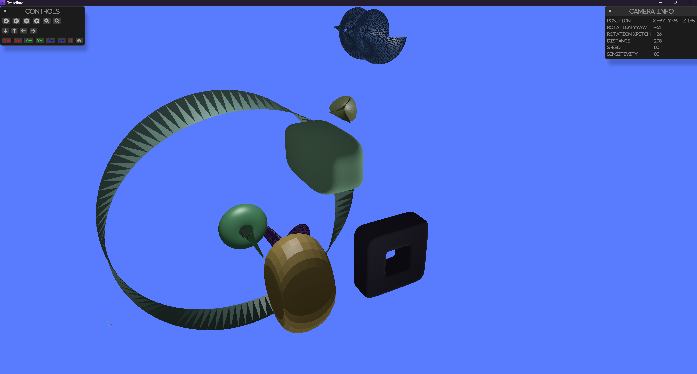

# Parametric Geometric Objects

Parametric geometric objects are a set of predefined geometric objects 
that can be generated by specifying a set of parameters. 
These objects are useful for generating simple geometric shapes that can be used for testing, 
visualization, and other purposes.



The running example can be found
in the <a href="https://github.com/besok/tessellate/tree/main/examples/parametric_shapes" target="_blank">repository</a>


The following parametric geometric objects are available in `tesselate`:
- [Bohemian dome](https://mathworld.wolfram.com/BohemianDome.html)
- [Bour](https://en.wikipedia.org/wiki/Bour%27s_minimal_surface)
- [Boy](https://en.wikipedia.org/wiki/Boy%27s_surface)
- [Conic spiral](https://en.wikipedia.org/wiki/Conic_spiral)
- [Dini surface](https://en.wikipedia.org/wiki/Dini%27s_surface)
- [Ellipsoid](https://en.wikipedia.org/wiki/Ellipsoid)
- [Mobius strip](https://en.wikipedia.org/wiki/M%C3%B6bius_strip)
- [Pseudosphere](https://en.wikipedia.org/wiki/Pseudosphere)
- [Superellipsoid](https://en.wikipedia.org/wiki/Superellipsoid)
- [Supertoroid](https://en.wikipedia.org/wiki/Supertoroid)

All shapes are created using the `tesselate` module.
The module provides a set of functions to create the shapes.
All shapes have  default method and `create` method.

### Example

```rust
use glam::Vec3;
use tessellate::mesh::shape::parametric::*;
use tessellate::mesh::material::Color;
fn mobius_strip() -> MobiusStrip {
    MobiusStrip::default()
}
fn super_ellipsoid() -> SuperEllipsoid {
    SuperEllipsoid::create(
        Vec3::new(3.0, 3.0, 2.0), 
        50, 
        1.0, 
        1.0, 
        2.0, 
        4.0, 
        5.0, 
        Color::default())
}
fn pseudo_sphere() -> Pseudosphere {
    Pseudosphere::default()
}

```