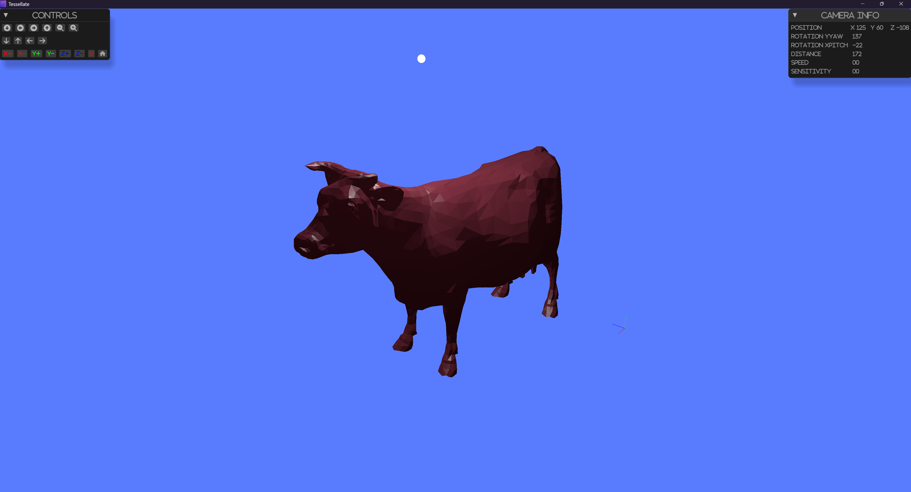

# Visualization

The library uses wgpu, egui, winit for visualization.

## Example

```rust

use env_logger::Builder;
use glam::{Mat4, Vec3};
use log::{info, LevelFilter};
use tessellate::gpu::options::{CameraOptions, GpuOptions, LightOptions};
use tessellate::mesh::material::{Color, RgbaColor};
use tessellate::mesh::transform::Transform;
use tessellate::mesh::{HasMesh, Mesh, MeshError};
use tessellate::{files, gpu, TessError, TessResult};
use tobj::LoadOptions;

fn main() -> TessResult<()> {
    let path = "examples/import_models/cow.obj";
    let mut cow = files::obj::import_obj(path, &LoadOptions::default())?;
    let meshes = vec![cow];
    let options = GpuOptions::default();
    Ok(gpu::visualize(meshes, options)?)
}


```

 


## Components

### Camera
The visualization gives the option to rotate,shift, scale the scene. The manipulations are performed 
around the center of the scene where the center is the centroid of the bounding box of the scene.
The initial position for the camera is set from the configurations.

### Light
The light affects the surfaces for the objects in the scene. The light is set from the configurations.
Every mesh has a set of light properties that can be set.

### Axes
The axes are drawn in the scene to give a sense of direction. The axes are drawn on the corner 
of the bounding box of the scene.

### UI
The UI is used to control the camera and light properties. The UI is drawn using egui.

