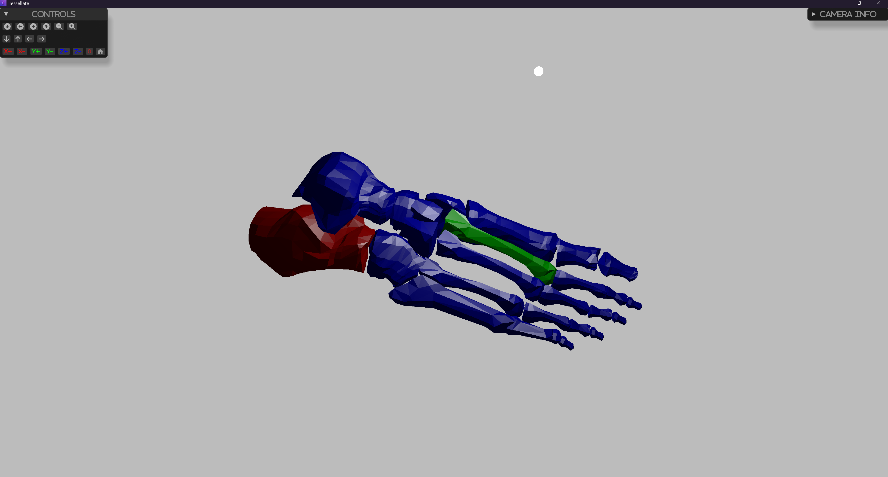

# Connectivity

This example demonstrates how to create and visualize basic 3D shapes using the `tessellate` library.
The query in this example is to find the connectivity of the vertices in the mesh.

See the methods:
 - `extract_connected_regions`
 - `extract_largest_connected_region`
 - `extract_connected_regions_by_vertexes`
 - `extract_closest_connected_region`

## How to Run

To run this example, use the following command:

```sh
cargo run --example connectivity
```

## Screenshot

 