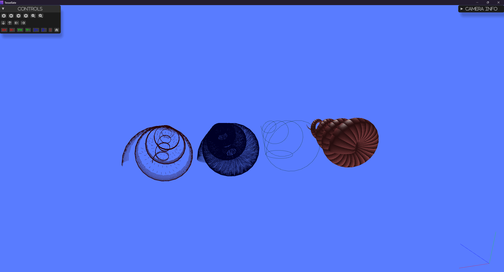

# Extracting Edges

This example demonstrates how to extract the edges of a polygons.

The edges of a mesh are one of the following:

 - boundary (used by one polygon) or a line cell

 - non-manifold (used by three or more polygons)

 - feature edges (edges used by two triangles and whose dihedral angle > feature_angle)

 - manifold edges (edges used by exactly two polygons).

## How to Run

To run this example, use the following command:

## Screenshot


```sh
cargo run --example extract_edges
```
