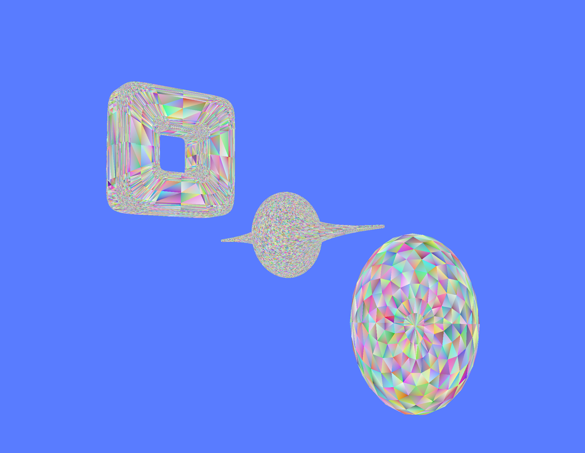

# Parametric Shapes Example

This example demonstrates how to create and visualize basic 3D shapes using the `tessellate` library.

## Shapes Included

The following shapes are included in this example:
- supertoroid

## How to Run

To run this example, use the following command:

```sh
cargo run --example parametric_shapes
```

## Screenshot



# Notes
Every shape has a Default method that creates a shape with default parameters. 
You can also create a shape with custom parameters by using the `new` method.