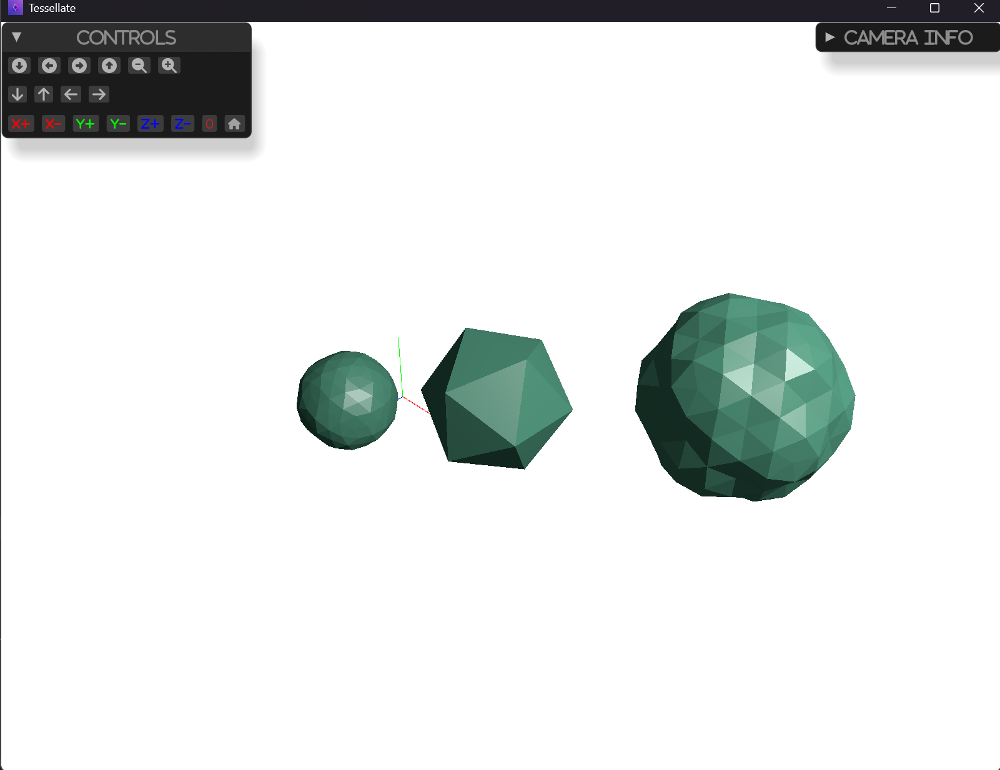

# Subdivide Cells Example

This example demonstrates how to subdivide cells of a mesh.
That increase the number of triangles in a single, connected triangular mesh.
 
The filter utilizes three different subdivision algorithms to subdivide a mesh’s cells: 
 - butterfly 
 - loop
 - linear.

## How to Run

To run this example, use the following command:

```sh
cargo run --example subdivide_cells
```

## Screenshot


# Notes
 